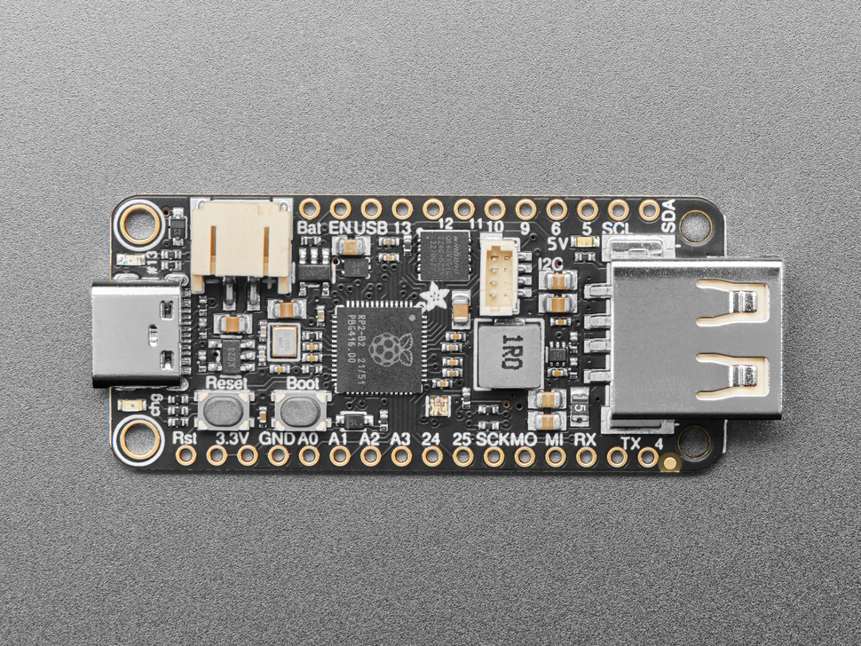
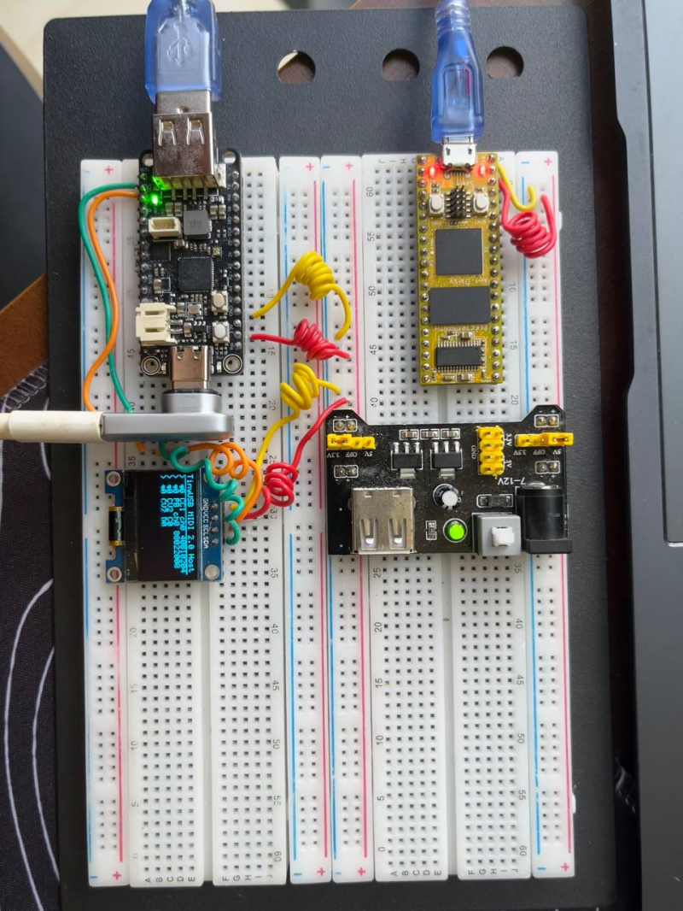
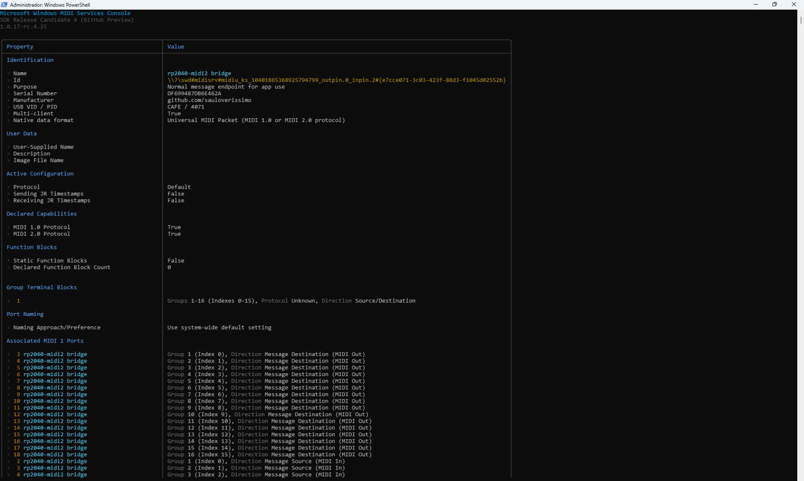
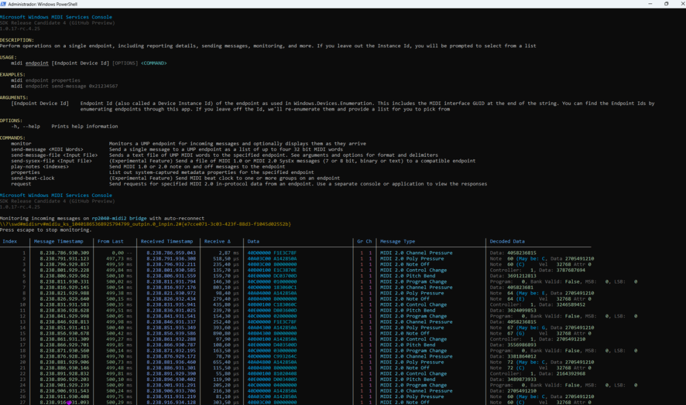
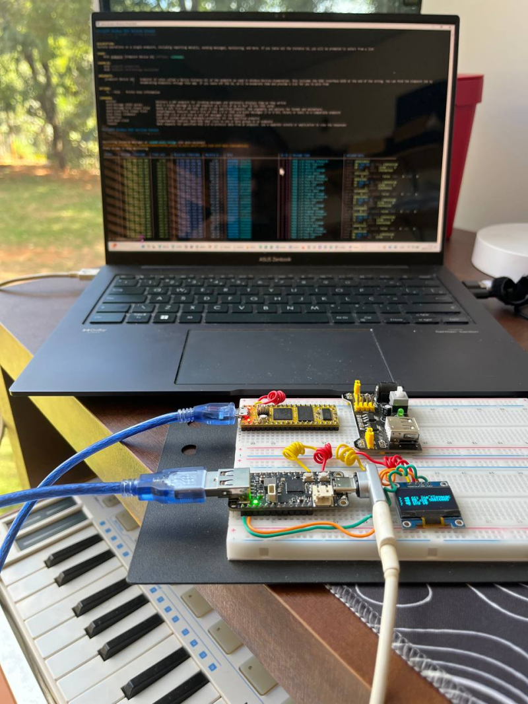

# [midi2_cpp](../..) | Bridge MIDI 2.0
## Adafruit Feather RP2040

Transparent USB MIDI 2.0 **bridge** on the **Adafruit Feather RP2040 USB Host**. Runs TinyUSB host on USB-A (PIO-USB GP16/GP17) and TinyUSB device on USB-C (native USB) in the same firmware, forwarding UMP between them so any MIDI 2.0 device plugged into USB-A appears on the PC as a 16-group MIDI 2.0 endpoint named `rp2040-midi2 bridge`. Lives at `midi2_cpp/examples/adafruit-feather-rp2040-bridge-midi2/` and consumes the parent library directly (no vendoring).



> ⚠️ **TinyUSB override, not yet upstream.** The USB MIDI 2.0 device + host class drivers this project depends on live in TinyUSB [PR #3571](https://github.com/hathach/tinyusb/pull/3571), still under review. Until that PR merges into `hathach/tinyusb`, this build pulls a personal fork ([`sauloverissimo/tinyusb` branch `feat/midi2-device-host-driver`](https://github.com/sauloverissimo/tinyusb/tree/feat/midi2-device-host-driver)) at a pinned SHA. Treat the build as **beta**: when the PR lands upstream the override goes away and this README will point at the official TinyUSB.

## What this is

`adafruit-feather-rp2040-bridge-midi2` is the platform layer for a dual-stack USB MIDI 2.0 bridge on the Adafruit Feather RP2040 USB Host. It owns:

- Pico SDK board init (`board_init`), USB-A 5V power gate (GP18)
- TinyUSB **device** stack on rhport 0 (native USB-C, DAW-facing)
- TinyUSB **host** stack on rhport 1 (PIO-USB GP16/GP17, upstream-facing)
- Single-threaded `ump_router` ring buffer that forwards UMP between the two stacks one message per main-loop iteration
- USB-MIDI 1.0 uplift on the host side: upstream `alt=0` cable events (CIN 0x8..0xE) become UMP MT 0x2 so the PC always sees clean MIDI 2.0
- Hot-swap watchdog: `tuh_deinit + tusb_init` after the upstream device has been gone for `MIDI2_CPP_BRIDGE_WATCHDOG_MS`

After `feather_bridge::init()`, the application sees only the bridge surface (`task`, `upstream_present`, `downstream_present`, `send_to_pc`). It never touches `tud_*`, `tuh_*`, `pico_*`, or any USB symbol. Replicating the same shape on another dual-stack board is a matter of writing `<board>_bridge.{h,cpp}` with the same surface.

## What this is not

Not a finished product. The bundled `adafruit-feather-rp2040-bridge-midi2-showcase` executable is a **demo application** that renders forwarded UMP on a 128x64 SSD1306 OLED with arrow markers (`>` upstream→PC, `<` PC→upstream) and emits a standalone showcase pattern when no upstream device is plugged in. Real applications copy this core and replace the showcase with their own behaviour layer:

- **Filter / transform**: modify UMP in transit (group remap, channel filter, MT 0x2 to MT 0x4 upscale)
- **Logger / recorder**: capture every UMP to flash with timestamps for offline analysis
- *(your project here)*

## Topology

```
                                 ┌──────────────────────────────────┐
PC / DAW ───── USB-C ───────────►│ Feather RP2040 USB Host          │
                                 │   rhport 0 (native USB device)   │
                                 │      ▲                           │
                                 │      │ ump_router (1 msg/iter)   │
                                 │      ▼                           │
                                 │   rhport 1 (PIO-USB host, GP16/17)│
                                 └──────────────────────────────────┘
                                          ▲
                                          │ USB-A
                                          │
                                  MIDI 2.0 device
                                  (or MIDI 1.0, uplifted)
```

## Identification

What the PC sees on the device side (USB-C):

| Field | Value |
|---|---|
| USB VID | `0xCAFE` |
| USB PID | `0x4071` |
| USB Manufacturer | `github.com/sauloverissimo` |
| USB Product | `rp2040-midi2 bridge` |
| MIDI 2.0 Groups | 16 (1:1 passthrough, group N upstream becomes group N to PC) |
| Function Blocks | 1 (covers all groups) |
| UMP Endpoint Name | `rp2040-midi2 bridge` |

## Build

Requirements:

- **Pico SDK 2.x** with `PICO_SDK_PATH` exported
- **arm-none-eabi-gcc** toolchain (Arm GNU embedded, 9+ recommended)
- **CMake 3.14+**
- Internet on the first `cmake -B build` (FetchContent pulls TinyUSB fork + Pico-PIO-USB)

```bash
git clone https://github.com/sauloverissimo/midi2_cpp.git
cd midi2_cpp/examples/adafruit-feather-rp2040-bridge-midi2
cmake -B build         # first run fetches deps (~5 MB TinyUSB + ~1 MB Pico-PIO-USB)
cmake --build build -j # offline from here on
```

Flash the resulting `build/adafruit-feather-rp2040-bridge-midi2-showcase.uf2` onto the Feather in BOOTSEL mode (drag-and-drop or `picotool load`).

To use a local fork or working copy on disk:

```bash
cmake -B build \
  -DPICO_TINYUSB_PATH=/path/to/your/tinyusb \
  -DPICO_PIO_USB_PATH=/path/to/your/Pico-PIO-USB
```

## Hardware

| Pin | Use |
|---|---|
| GP16 | USB-A D+ (PIO-USB host) |
| GP17 | USB-A D- (PIO-USB host) |
| GP18 | USB-A 5V power gate (driven high in `feather_bridge::init`) |
| GP2  | I2C1 SDA (STEMMA QT, SSD1306 0x3C) |
| GP3  | I2C1 SCL (STEMMA QT, SSD1306 0x3C) |
| GP0  | UART TX (debug print @ 115200 8N1) |
| GP1  | UART RX |
| USB-C | programming + bridged MIDI 2.0 endpoint to the PC (CDC stdio disabled, UART only) |

| Component | Use |
|---|---|
| Adafruit Feather RP2040 USB Host | RP2040 + native USB-C (device) + USB-A via PIO-USB (host) |
| Upstream USB MIDI device | source under test, UMP or USB-MIDI 1.0, both supported |
| 128x64 SSD1306 OLED (I2C 0x3C) | live forwarded UMP display, on STEMMA QT |

## Showcase

What the bundled `adafruit-feather-rp2040-bridge-midi2-showcase` executable demonstrates after enumeration. The showcase runs in three modes, switching automatically based on connectivity:

**Mode `Waiting`**, no PC mount yet:

- Splash + spinner while waiting for USB-C enumeration

**Mode `Showcase`**, PC mounted, no upstream device on USB-A:

- Bridge emits its own UMP from the device side so a connected DAW can validate the link without an upstream
- Chromatic walk C4 to B4: NoteOn/Off every 250 ms (24 steps total, MT 0x4, group 0, ch 0, vel `0xC000`)
- CC #74 (Brightness) 32-bit sweep every 6 s (5 points spread across the 32-bit range)

**Mode `Bridging`**, PC mounted, upstream device on USB-A:

- Showcase pauses, forward path takes over
- Upstream UMP flows raw to the PC (group preserved, no remap)
- PC UMP flows to the upstream (only when upstream is MIDI 2.0 alt=1 in v0.1)
- USB-MIDI 1.0 upstream cable events are uplifted to UMP MT 0x2 so the PC always sees clean MIDI 2.0
- OLED shows live decoded UMP with `>` markers (upstream→PC) and `<` markers (PC→upstream)

UART debug on GP0 mirrors mount events for headless monitoring.

### Bench setup



The protoboard in the photo wires the example end to end:

- **Adafruit Feather RP2040 USB Host** (top-left): the bridge MCU. Two USB ports do different jobs: the black USB-A connector on top is the **host** input (rhport 1, PIO-USB on GP16/GP17) and the USB-C on the side is the **device** output (rhport 0, native USB) that goes to the PC.
- **Daisy Seed** (top-right): a MIDI 2.0 device flashed with MIDI 2.0 firmware, plugged into the Feather's USB-A as the upstream source. Any other UMP device works the same way (Teensy 4.x MIDI 2.0, our [`rp2040-midi2`](../rp2040-midi2) or [`waveshare-rp2040-midi2`](../waveshare-rp2040-midi2), etc).
- **128x64 SSD1306 OLED** (bottom-left, on STEMMA QT I2C1 GP2/GP3): live forwarded UMP with arrow markers (`>` for upstream→PC, `<` for PC→upstream) and a status bar.
- **External 5V supply module** (bottom-right): provides clean 5V/3.3V to the protoboard rails. The Feather's GP18 power gate forwards that 5V to the upstream device through the USB-A connector. An external supply matters here because the upstream device, the Feather, the OLED, and the bridged USB-C link all share the same 5V rail and a marginal laptop USB port can sag.
- **Jumper wires**: I2C SDA + SCL between the Feather and the OLED, plus power and ground rails distributed across the board.

End-to-end with a Daisy Seed plugged into the USB-A port and the bridge USB-C connected to a laptop running [Microsoft MIDI Services Console](https://github.com/microsoft/MIDI):





## v0.1 scope and limitations

- **Single upstream device** at a time (idx 0). A second device plugged in is enumerated by TinyUSB but not forwarded; OLED logs the mount, no traffic flows.
- **MIDI 1.0 uplift is one-way**: upstream cable events become UMP MT 0x2 on the PC (`>` direction). PC to upstream UMP is forwarded only when the upstream is MIDI 2.0; when it is MIDI 1.0 alt=0, downstream UMP is dropped silently. v0.2 will add UMP to cable conversion for full bidirectional MIDI 1.0 support.
- **Group remap is 1:1**: whatever group the upstream emits is the group the PC sees. A future variant could fan multiple upstreams onto separate group ranges.
- **No CI bridging**: each USB link runs its own MIDI-CI Initiator/Responder when applicable. CI traffic is not proxied across the bridge, that would be a separate feature.

## Hot-swap caveat

The TinyUSB host stack on RP2040 can occasionally get stuck after the upstream device is unplugged and fail to re-enumerate on re-plug. A 3 s watchdog in `feather_bridge::task` works around this: when the upstream side has been gone for `MIDI2_CPP_BRIDGE_WATCHDOG_MS`, the host side is reset (`tuh_deinit` + `tusb_init`). Default 3000 ms, tunable at compile time:

```bash
cmake -B build -DMIDI2_CPP_BRIDGE_WATCHDOG_MS=5000   # 5 s
cmake -B build -DMIDI2_CPP_BRIDGE_WATCHDOG_MS=0      # disable
```

## What lives where

```
midi2_cpp/
├── src/                            parent library (only midi2.c is consumed,
│                                   for midi2_msg_word_count)
└── examples/adafruit-feather-rp2040-bridge-midi2/
    ├── CMakeLists.txt              FetchContent for TinyUSB PR #3571 + Pico-PIO-USB
    ├── pico_sdk_import.cmake
    ├── README.md
    ├── board/
    │   ├── banner.png              repo banner (used in this README)
    │   └── rp2040-feather-host-pinout.png   Feather RP2040 USB Host GPIO reference
    ├── monitor/
    │   ├── prototype.png           bridge running on protoboard
    │   ├── stack.png               bench setup with Daisy upstream + Windows monitor
    │   ├── windows_1.png           Microsoft MIDI Services Console identity view
    │   └── windows_2.png           Microsoft MIDI Services Console message log
    └── src/
        ├── feather_bridge.{h,cpp}  dual TinyUSB init + task pump + cable→UMP
        ├── ump_router.{h,c}        single-threaded ring buffer (64 msgs/queue)
        ├── usb_descriptors.c       device descriptors (MIDI 2.0, 16 groups)
        ├── tusb_config.h           CFG_TUH + CFG_TUD enabled, both rhports
        ├── display.{h,c}           SSD1306 driver (reused from host example)
        ├── font5x7.h               5x7 ASCII bitmap font (reused)
        └── main.cpp                showcase entry, bridge callbacks → display_log
```

The TinyUSB PR #3571 fork and Pico-PIO-USB are fetched at configure time into `build/_deps/` (gitignored). This example folder itself is ~1 MB.

## License

MIT, inherits the parent [`midi2_cpp` LICENSE](../../LICENSE). The TinyUSB fork (fetched on demand) is MIT (upstream by hathach, fork by sauloverissimo carrying the MIDI 2.0 class drivers from the still-open [PR #3571](https://github.com/hathach/tinyusb/pull/3571)). Pico-PIO-USB is MIT.
