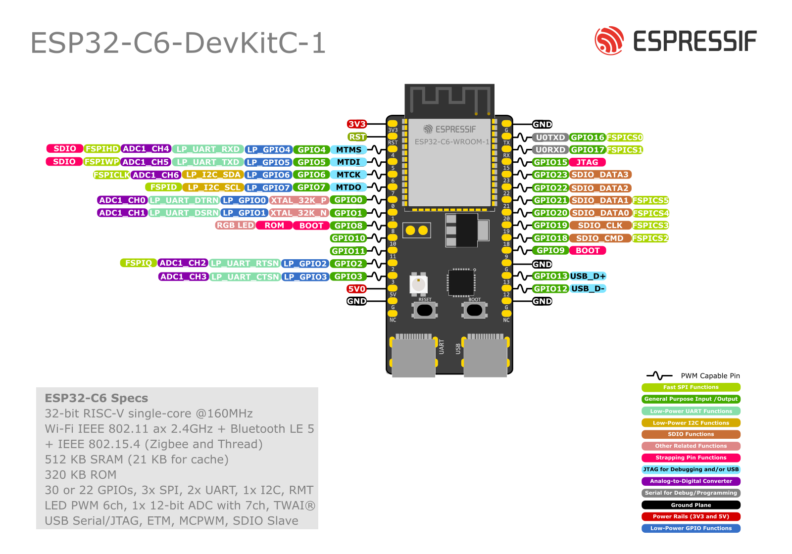

# [midi2_cpp](../..) | Device MIDI 2.0
## ESP32-C6-DevKitC-1

Wireless MIDI 2.0 **device** example for the **ESP32-C6-DevKitC-1**, exposing two transports in parallel: **BLE-MIDI 1.0** (standard Apple/MIDI Association service UUID) and **ESP-NOW** (peer-to-peer, broadcast on WiFi channel 1). The C6 has no USB-OTG hardware, only USB-Serial-JTAG, so the canonical USB MIDI 2.0 device interface used by the rest of the recipe family is unavailable on this chip; this recipe demonstrates the wireless path instead. Lives at `midi2_cpp/examples/esp32-c6-devkitc-multi-midi2/` and consumes the parent `midi2_cpp` library directly via PlatformIO `lib_extra_dirs`.



This is the first recipe in the `midi2_cpp/examples/` tree that ships **without a USB device interface**. Both wire transports carry MIDI 1.0 byte streams natively (BLE-MIDI 1.0 spec, ESP-NOW small payload limit of 4 bytes). Bytes are uplifted in firmware to UMP MT 0x2 via `midi2::ByteStreamConverter` so the application sees the same typed `midi2::Device` dispatch surface used by the USB recipes; outbound UMP from the showcase loop is downgraded back to MIDI 1.0 bytes before hitting the wire.

## What this is

Platform recipe for the ESP32-C6-DevKitC-1 acting as a wireless MIDI 2.0 endpoint. It owns:

- **`ESP32_Host_MIDI` v6.0.0 `BLEConnection`** wired against the arduino-esp32 v3.x NimBLE stack. The advertised name is the project Endpoint Name (`Esp32C6Multi`); the BLE-MIDI 1.0 service UUID is the standard Apple value `03B80E5A-EDE8-4B33-A751-6CE34EC4C700`.
- **`ESP32_Host_MIDI` v6.0.0 `ESPNowConnection`** in WiFi STA mode without an AP association, on channel 1, broadcasting on `FF:FF:FF:FF:FF:FF` so any peer on the same channel receives every emitted note. The local MAC is read at boot and printed to Serial for unicast pairing.
- **`midi2::Device`** wrapper sitting on the UMP stream. The `setWriteFn` fan-out converts UMP MT 0x2 (and downgraded MT 0x4) to MIDI 1.0 bytes and submits them to both transports in parallel.
- **`midi2::ByteStreamConverter`** (one per transport, group 0 = BLE, group 1 = ESP-NOW) that uplifts incoming MIDI 1.0 bytes to UMP MT 0x2 before calling `Device::feedRx`. Running Status, channel preservation, and SysEx fragmentation are handled by the converter.
- **Typed UMP dispatch** through `midi2::Device` callbacks (`onNoteOn`, `onNoteOff`, `onCC`, `onProgram`, `onPitchBend`, `onChannelPressure`). The recipe traces every event to UART with the source group prefix (`BLE  ` or `ESPNW`) so a single Serial monitor session shows traffic from both transports.
- **UART log** at 115200 8N1 on the right-side jack (CH340 USB-to-UART, `/dev/ttyACM0` on Linux because the CH340 enumerates as CDC-ACM). Same jack is used for `pio run -t upload`.

After `setup()`, the application sees only `midi2::Device`. Replicating the same shape on another ESP32 chip with both BLE and WiFi (S3, C3, H2 with appropriate radio caveats) is a matter of adjusting `platformio.ini`'s `board` field; the source is portable.

## What this is not

Not a finished product. The bundled showcase is a **demo application**: it walks a C major scale every 350 ms, sending Note On / Note Off plus a CC #1 (Mod Wheel) sweep on both transports, and traces every received MIDI byte to UART. Real applications copy this core and replace the showcase loop with their own behaviour layer, for example:

- A wireless drum trigger array reporting impact velocity on ESP-NOW broadcast to a stage rack
- A BLE-MIDI keyboard slave for iOS / iPadOS music apps with optional ESP-NOW link to a backline rack
- A two-zone wireless controller that uses ESP-NOW for ultra-low-latency pairings between two boards in the same rack and BLE-MIDI for tablet remote control

## Identification

This recipe presents no USB device interface. **No PID is consumed** from the project pool. Identity is per transport.

### BLE

| Field | Value |
|---|---|
| Role | BLE peripheral (GATT server) |
| Service UUID | `03B80E5A-EDE8-4B33-A751-6CE34EC4C700` (BLE-MIDI 1.0, Apple/MIDI Association) |
| Characteristic UUID | `7772E5DB-3868-4112-A1A9-F2669D106BF3` |
| Advertised device name | `Esp32C6Multi` |
| MAC address | burned-in (read at boot, printed to UART, never hard-coded) |
| MIDI-CI MUID | not applicable in v0.1 of this recipe (BLE-MIDI 1.0 carries no UMP / no MIDI-CI on the wire) |

### ESP-NOW

| Field | Value |
|---|---|
| Role | ESP-NOW broadcaster + receiver, WiFi STA mode (no AP association) |
| WiFi channel | 1 (recipe constant; both peers must match) |
| Peer addressing | broadcast on `FF:FF:FF:FF:FF:FF` by default; `ESPNowConnection::addPeer` switches to unicast |
| Local MAC | burned-in (printed at boot for pairing convenience) |
| MIDI-CI MUID | not applicable in v0.1 (ESP-NOW carries raw MIDI 1.0 byte payloads) |

The recipe never declares a USB VID / PID; those are not applicable to a chip without USB-OTG hardware. The MIDI Manufacturer ID seen in any future SysEx the recipe emits is `{0x7D, 0x00, 0x00}` (educational prefix), the same as the rest of the example portfolio.

## Build

Requirements:

- **PlatformIO Core** 6.x or newer (`pio --version`)
- The ESP32-C6-DevKitC-1 board, one USB-C cable to the right-side jack (CH340 USB-to-UART for log + flash). The left-side jack is USB-Serial-JTAG; either jack can flash the chip, but the recipe defaults to the CH340 path because of its hardware DTR / RTS auto-reset.
- Internet on the first run (PlatformIO clones `ESP32_Host_MIDI` v6.0.0 from GitHub on `pio run`)

```bash
git clone https://github.com/sauloverissimo/midi2_cpp.git
cd midi2_cpp/examples/esp32-c6-devkitc-multi-midi2/pio
pio run
pio run -t upload -t monitor
```

This recipe uses [`ESP32_Host_MIDI`](https://github.com/sauloverissimo/ESP32_Host_MIDI) v6.0.0 and arduino-esp32 v3.x. The `espressif32` PlatformIO platform stops at the S3 family; ESP32-C6 support comes from the community fork [`pioarduino/platform-espressif32`](https://github.com/pioarduino/platform-espressif32) pinned to release `53.03.13`. The recipe consumes the parent `midi2_cpp` library via `lib_extra_dirs = ../../..`, so `git clone` of `midi2_cpp` is enough to build; the source is local.

The partition table is set to `huge_app.csv` (3 MB app slot) because the BLE + WiFi + ESP-NOW combined image plus arduino-esp32 v3 occupies more flash than the default 1.6 MB layout.

### Flashing via the left jack (USB-Serial-JTAG, `/dev/ttyACM*`), recommended

The C6 chip has a built-in USB-Serial-JTAG controller wired to the left jack. esptool talks to it directly over USB DFU, so no auto-reset circuit is involved and the flash succeeds without any button press.

```bash
pio run -t upload --upload-port /dev/ttyACM1
pio device monitor -p /dev/ttyACM0
```

The USB-Serial-JTAG endpoint enumerates as `303a:1001 Espressif USB JTAG/serial debug unit` (the `Espressif` device in `lsusb`). The Serial monitor lives on the right jack (CH340) at 115200 8N1; the JTAG endpoint carries only the boot ROM messages and esptool traffic.

### Flashing via the right jack (CH340 USB-to-UART, `/dev/ttyACM0`)

The CH340 path depends on the auto-reset circuit pulling EN and IO9 via DTR / RTS. On some ESP32-C6-DevKitC-1 revisions the strapping jumpers J1 / J2 are not populated and esptool reports `Failed to connect: No serial data received`. When this happens, fall back to the USB-Serial-JTAG path above. Manual download mode (hold BOOT, pulse RST, release BOOT) also works on the CH340 path when the jumpers are missing, but it is fiddlier than just using the left jack.

```bash
pio run -t upload -t monitor
```

## Hardware

| Pin / port | Use |
|---|---|
| USB-C (right jack, CH340) | Host UART log @ 115200 8N1 + esptool flash entry. Default `/dev/ttyACM0`. |
| USB-C (left jack, USB-Serial-JTAG) | Native USB-Serial-JTAG for flashing + secondary console (`CONFIG_ESP_CONSOLE_SECONDARY_USB_SERIAL_JTAG`). |
| 2.4 GHz PCB antenna (top edge) | Shared by WiFi (ESP-NOW) and Bluetooth 5 LE (BLE-MIDI). Coexistence is handled by the WiFi / BT controller; no app-level arbitration in this recipe. |
| GPIO8 | On-board RGB LED (WS2812). Not driven by this recipe. |
| BOOT (GPIO9) | Hold during reset to enter download mode (only needed on the USB-Serial-JTAG path if auto-reset fails). |
| RESET | Reboot. |

The C6 ships a single-core 32-bit RISC-V Wi-Fi 6 + Bluetooth 5 LE + 802.15.4 (Zigbee / Thread) radio. Only the WiFi 4 / 5 paths in arduino-esp32 v3 are exercised here (ESP-NOW does not need 802.11ax mode; BLE uses the BT 5 LE radio). 802.15.4 is unused in this recipe.

## Spec coverage

**Tier B** (MIDI 1.0 wire, UMP MT 0x2 surface). The C6 is RAM-rich (512 KB SRAM) and could carry a richer dispatch table, but the wire transports themselves cap out at MIDI 1.0 byte payloads. Promoting this recipe to Tier A would require adding a UMP-over-BLE custom service or an UMP-over-ESP-NOW packing scheme, neither of which is in v0.1 scope.

### What this recipe receives, decodes, and emits

| UMP MT | Direction | Spec section | What the recipe does |
|---|---|---|---|
| 0x2 MIDI 1.0 Channel Voice in UMP | RX + TX | M2-104-UM §5 | uplifted from BLE / ESP-NOW byte streams via `midi2::ByteStreamConverter`, dispatched through `Device::onNoteOn / onNoteOff / onCC / onProgram / onPitchBend / onChannelPressure / onPolyPressure`. The showcase loop emits Note On / Off + CC via `Device::sendNoteOn1 / sendNoteOff1 / sendCC1` (MT 0x2 generators). |
| 0x4 MIDI 2.0 Channel Voice | TX only (downgrade path) | M2-104-UM §7 | the `setWriteFn` fan-out detects MT 0x4 words and downgrades them to MT 0x2 via `Device::downgradeMt4ToMt2` before serialising. RX is not exercised because neither wire transport carries 32-bit MIDI 2.0 values. |
| 0x1 System Real-Time / Common | TX | M2-104-UM §4 | the dispatch path emits one byte per System UMP word; not exercised by the showcase loop. |
| 0x3 SysEx7 | dropped | M2-104-UM §6 | SysEx fragmentation across BLE 20-byte packets and ESP-NOW 4-byte packets is not implemented in v0.1. The path is documented as a known limitation; multi-packet SysEx requires per-transport reassembly that does not match the 1-2-3-byte mt2WordToBytes fan-out. |
| 0x5 SysEx8, 0xD Flex Data, 0xF UMP Stream | dropped | M2-104-UM §8-10 | none of these have a MIDI 1.0 byte representation; the fan-out skips them with the correct word stride so dispatch state stays in sync. |

### MIDI-CI surface (M2-101-UM)

| Subsystem | Coverage |
|---|---|
| Discovery / Profile / PE / PI | not applicable in v0.1; no MIDI-CI traffic is exchanged on the BLE-MIDI 1.0 or ESP-NOW wire because both are MIDI 1.0 byte streams, and SysEx-based MIDI-CI requires the SysEx7 reassembly path that is not in scope (see above). |

### What this recipe does NOT cover (and why)

- **UMP-over-BLE custom service**: would require a non-standard BLE service that some MIDI 2.0 hosts already prototype. Out of scope for v0.1; would also drop interoperability with iOS / iPadOS BLE-MIDI clients.
- **UMP-over-ESP-NOW**: would require a custom 32-bit-word framing on top of the 4-byte ESP-NOW payload. Out of scope for v0.1.
- **SysEx7 reassembly across BLE / ESP-NOW packets**: requires per-transport state (BLE running buffer, ESP-NOW datagram concatenation by source MAC). Defer to a future v0.2 of this recipe.
- **BLE central role**: the ESP32_Host_MIDI BLEConnection is peripheral-only. A central role would let the C6 connect to a phone or tablet acting as a peripheral, which is a different use case.

Honest baseline. If a future cycle adds the items above, this section gets updated rather than left optimistic.

## Showcase

What the bundled `firmware.bin` does after boot. UART log lives on the right-side jack at 115200 8N1.

### Always-on (boot to forever)

- BLE advertiser running with name `Esp32C6Multi`. Any BLE-MIDI 1.0 client (iOS GarageBand, macOS Audio MIDI Setup with the BLE bridge, Android USB MIDI BLE Bridge, MIDI BLE Connect on Windows) sees the device after a scan.
- ESP-NOW STA mode active on channel 1, ready to broadcast / receive on `FF:FF:FF:FF:FF:FF`. Local MAC printed at boot for unicast pairing.
- midi2::Device wired with typed callbacks; ByteStreamConverter active per transport.

### Showcase loop (every 350 ms)

| Step | What is emitted | Where it goes |
|---|---|---|
| Note Off (previous note) | three MIDI bytes `0x80 / note / 0x00` | BLE notify + ESP-NOW broadcast (when the respective transport reports `isConnected()`) |
| Note On (next scale degree) | three MIDI bytes `0x90 / note / 0x60` | both transports as above |
| CC #1 sweep | three MIDI bytes `0xB0 / 0x01 / value` | both transports as above |

The scale walked is C major (`60, 62, 64, 65, 67, 69, 71, 72`); `value` for CC #1 increments by 16 per step and wraps back to 0 after the octave.

### Per inbound packet

Any MIDI 1.0 byte stream arriving on either transport is uplifted to UMP MT 0x2, dispatched through `midi2::Device`, and printed as one line per event with a source tag:

```
[NoteOn  ] BLE   g=0 ch=1  note=60  vel=0x6000
[NoteOff ] BLE   g=0 ch=1  note=60  vel=0x0000
[CC #1   ] ESPNW g=1 ch=1  val=0xFFFFFFFF
```

Velocity / value widths reflect the 7-bit -> 16-bit / 32-bit upscale done by the dispatch layer; the wire side stays MIDI 1.0.

## Validation

Hardware steps:

1. Cable the right-side jack of the ESP32-C6-DevKitC-1 to your dev machine. CH340 enumerates as `/dev/ttyACM0` on Linux (or `COMx` on Windows).
2. Flash via the right jack: `pio run -t upload -t monitor`. The boot banner should print, followed by the BLE advertiser line and the ESP-NOW MAC line.
3. **BLE validation** (any BLE-MIDI 1.0 client):
   - **Linux** with BlueZ 5.65+: `bluetoothctl scan on` should show `Esp32C6Multi`. Pair, then route the BLE-MIDI virtual port through `aseqdump -p '<port>'` to see incoming notes from the showcase loop.
   - **macOS / iOS** Audio MIDI Setup -> Bluetooth: connect to `Esp32C6Multi`, then any DAW (Logic, AUM, GarageBand) sees it as an input. The Note On / Off scale shows up in the DAW's MIDI monitor.
   - **Windows 10 / 11** Settings -> Bluetooth & devices -> Add device. Pair with `Esp32C6Multi`. The default Microsoft BLE-MIDI driver exposes it to any DAW (Cakewalk, Reaper).
4. **ESP-NOW validation** (peer board): flash any second ESP32 with the [Espressif esp-now examples](https://github.com/espressif/esp-now) `responder` recipe set to channel 1, or run a second copy of this firmware on another ESP32-C6 / S3 / C3 board. Notes emitted by the showcase loop on board A should print on the UART log of board B.
5. Send notes back: any MIDI source on either transport (BLE-MIDI keyboard app, ESP-NOW peer board) results in `[NoteOn  ] BLE   ...` or `[NoteOn  ] ESPNW ...` lines on the UART of this board.

> **Sibling cross-link.** The companion ESP32-S3 USB MIDI 2.0 device recipe [`esp32-s3-devkitc-usb-midi2`](../esp32-s3-devkitc-usb-midi2/) covers the same role in the family for a chip that has USB-OTG. The S3 recipe is the canonical Tier A reference for the device side; this C6 recipe is the wireless complement for the chip with no USB device interface.

## Hardware validation status (v0.1, 2026-05-01, ESP32_Host_MIDI v6.0.0)

Validated on hardware: ESP32-C6-DevKitC-1, MAC `98:A3:16:AA:7D:20`, flashed via the left-jack USB-Serial-JTAG (`/dev/ttyACM1`) at 3.7 s for the 1.8 MB image. Boot Serial captured on the right-jack CH340 (`/dev/ttyACM0`).

| Path | Status | Evidence |
|---|---|---|
| Build green | OK | RAM 19.7% (64 676 / 327 680 bytes), Flash 56.2% (1 767 761 / 3 145 728 bytes), zero warnings |
| Flash via USB-Serial-JTAG | OK | esptool v4.8.6, 1 801 328 bytes (1 039 500 compressed), 3851 kbit/s, hash verified |
| Boot + banner visible on Serial | OK | three line banner printed at boot on the CH340 jack |
| BLE advertiser running | OK | `[BLE] advertised name = "Esp32C6Multi"`, `[BLEDevice.cpp:553] getAdvertising(): create advertising` |
| ESP-NOW initialised + MAC printed | OK | `[ESPNW] begin() = ok, channel = 1`, `local MAC = 98:A3:16:AA:7D:20` |
| Showcase loop entered | OK | `[Ready] showcase loop emits a C major scale every 350 ms` |
| BLE-MIDI: scale heard in a DAW | pending | requires phone / laptop with BLE-MIDI client paired to `Esp32C6Multi` |
| ESP-NOW: scale received on a second peer board | pending | requires a second ESP32 on channel 1 in receive mode |
| Inbound BLE-MIDI: notes uplifted to UMP MT 0x2 | pending | requires BLE-MIDI keyboard or sequencer paired and emitting Note On |

## Hot-swap caveat

BLE central disconnects (phone walks away) and reconnects without firmware reset; `BLEConnection::isConnected()` flips back to true on the next central. ESP-NOW has no connection lifecycle (it is connectionless); `ESPNowConnection::isConnected()` is true after `begin()` succeeds and stays true until reboot. Re-pairing does not require a flash.

## What lives where

```
midi2_cpp/
├── src/                            parent library (consumed by this recipe
│                                   via lib_extra_dirs in pio/platformio.ini)
└── examples/esp32-c6-devkitc-multi-midi2/
    ├── README.md
    ├── board/
    │   ├── banner.png              repo banner (placeholder = pinout image)
    │   ├── pinout.png              ESP32-C6-DevKitC-1 pin layout (Espressif)
    │   ├── ESP32-C6-DevKitC-1-Schematic.pdf    schematic v1.4 (Mar 2024+)
    │   └── ESP32-C6-DevKitC-1-Dimensions.pdf   PCB dimensions v1.2
    ├── monitor/                    bench / serial-log captures (TBD)
    └── pio/
        ├── platformio.ini          pioarduino/platform-espressif32 53.03.13,
        │                           board esp32-c6-devkitc-1, framework arduino,
        │                           lib_deps = ESP32_Host_MIDI v6.0.0,
        │                           lib_extra_dirs = ../../.. (midi2_cpp),
        │                           board_build.partitions = huge_app.csv
        └── src/
            └── main.cpp            full showcase entry: BLE + ESP-NOW transports,
                                    midi2::Device wiring, ByteStreamConverter
                                    per transport, Serial trace
```

The MCU silicon datasheet is not bundled; it is shared across every ESP32-C6 recipe and changes infrequently. Read it on Espressif's site: [ESP32-C6 series datasheet](https://www.espressif.com/sites/default/files/documentation/esp32-c6_datasheet_en.pdf).

## License

MIT, inherits the parent [`midi2_cpp` LICENSE](../../LICENSE). [`ESP32_Host_MIDI`](https://github.com/sauloverissimo/ESP32_Host_MIDI) is also MIT (same author / maintainer). The Arduino framework, NimBLE-Arduino, and the Espressif IDF components pulled by PlatformIO carry their own respective licenses (Apache 2.0, ESP-IDF mix). The board reference images and PDFs under `board/` are © Espressif Systems and redistributed for documentation purposes.
