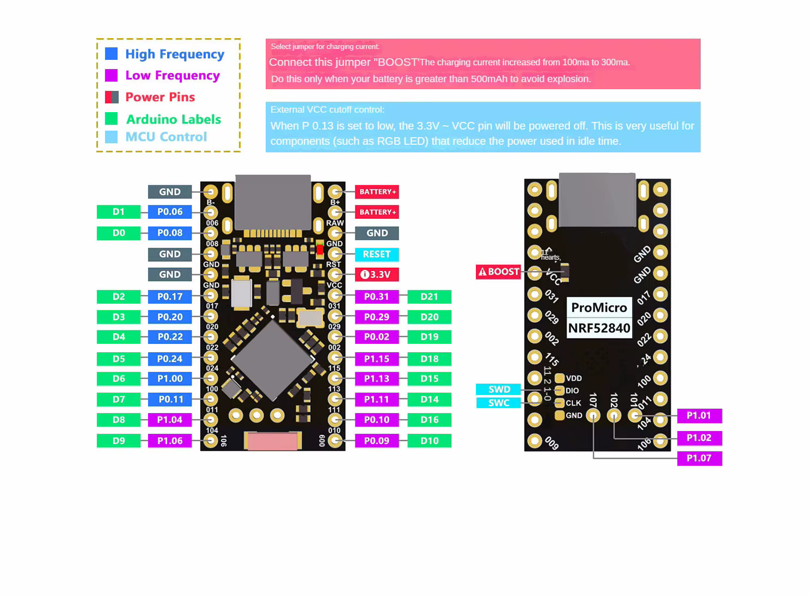

# [midi2_cpp](../..) | Device MIDI 2.0
## nRF52840 Pro Micro

Tier B standard-subset USB MIDI 2.0 device example for **nRF52840 Pro Micro**-class boards (Nice!Nano, BlueMicro840, FYSETC nRF52840 Pro Micro, generic clones). nRF52840 Cortex-M4F at 64 MHz, 256 KB SRAM, 1 MB flash, native USB FS. Single-file Arduino sketch with chromatic walk + Per-Note Pitch Bend + RPN/NRPN/Relative + Stream Discovery + JR Timestamp heartbeat. Lives at `midi2_cpp/examples/nrf52840-promicro-midi2/`.



> ⚠️ **Adafruit_TinyUSB_Arduino fork required, not yet upstream.** This sketch depends on `Adafruit_USBD_MIDI2`, the wrapper class added by a fork of [`adafruit/Adafruit_TinyUSB_Arduino`](https://github.com/adafruit/Adafruit_TinyUSB_Arduino) that vendors TinyUSB at the [PR #3571](https://github.com/hathach/tinyusb/pull/3571) commit (`31d730d8b...`). Until both upstreams (Adafruit + TinyUSB) merge the support, install the fork manually. See **Build** below.

PID `0x40F1` distinguishes this device from the other Tier 3 / experimental recipes. The window is `0x40F0..0x40FF`.

## What this is

`nrf52840-promicro-midi2.ino` is a single-file sketch demonstrating Tier B MIDI 2.0 device scope on the nRF52840:

- **MIDI-CI Discovery responder**
- **UMP Stream Discovery responder**
- **JR Timestamp heartbeat** every 500 ms (MT 0x0)
- **13 s scene cycle**:
  - **Per-Note Pitch Bend** vibrato on note C4 (5 Hz, ~3.6 s sustained)
  - **Chromatic walk** C5 to G#5 with 16-bit velocity ramp + 32-bit CC #74 sweep
  - **RPN 0/0** (Pitch Bend Sensitivity), **NRPN 0x12/0x34**, **Relative RPN +delta**, **Relative NRPN -delta**

No SysEx, no Flex Data, no Property Exchange storage, no Process Inquiry advertising. The nRF52840 has the cycles and SRAM for those, but the v0.1 recipe stays Tier B to keep the sketch under 400 lines and to leave headroom for the user's own code (sensor inputs, BLE peer link, Nordic SoftDevice).

## What this is not

Not a finished product. Real-world nRF52840 Pro Micro applications can extend this sketch with:

- **BLE-MIDI 2.0** transport on the same firmware (nRF52840 has SoftDevice radio)
- **Capacitive keys** via the QSPI / TWI peripherals emitting Per-Note expression
- **Persistent identity** in QSPI flash (the sketch regenerates MUID per boot today)

## Identification

| Field | Value |
|---|---|
| USB VID | `0xCAFE` |
| USB PID | `0x40F1` |
| USB Manufacturer | `github.com/sauloverissimo` |
| USB Product | `Nrf52840ProMicro` |
| Endpoint Name | `Nrf52840ProMicro` |
| Product Instance ID | `Nrf52840ProMicro-showcase-0001` |
| MIDI-CI Manufacturer ID | `{0x7D, 0x00, 0x00}` (MIDI Association educational/non-commercial prefix) |
| MIDI-CI Family / Model / Version | `0x0001 / 0x0001 / 0x00010000` |

The USB VID `0xCAFE` is the TinyUSB educational identifier. **Production firmware MUST replace both `idVendor` and `idProduct`** with a real allocation (`0x1209` pid.codes, `0x16C0` V-USB, or a purchased USB-IF VID).

## Build

Requirements:

1. **Arduino IDE 2.x** or **arduino-cli 1.0+**
2. **Adafruit nRF52 board package** in the Arduino Boards Manager (URL: `https://www.adafruit.com/package_adafruit_index.json`); choose **Adafruit Bluefruit nRF52** core, then board "Nice!Nano", "Adafruit Feather nRF52840 Express", or your specific Pro Micro variant
3. **Adafruit_TinyUSB_Arduino fork** with TinyUSB PR #3571 vendored (see below)
4. **midi2_cpp library** in the Arduino sketchbook's `libraries/` folder

### Install the Adafruit_TinyUSB_Arduino fork

```bash
cd ~/Arduino/libraries
git clone https://github.com/sauloverissimo/Adafruit_TinyUSB_Arduino.git
cd Adafruit_TinyUSB_Arduino
git checkout feat/midi2  # branch carrying the PR #3571 vendored TinyUSB
```

If the fork branch does not exist yet, the user can build it locally per the steps in [`xiao-samd21-midi2`](../xiao-samd21-midi2/README.md#install-the-adafruit_tinyusb_arduino-fork). The path is the same for SAMD21 and nRF52840.

### Install midi2_cpp

```bash
cd ~/Arduino/libraries
git clone https://github.com/sauloverissimo/midi2_cpp.git
```

### Compile and upload

For Nice!Nano (Adafruit nRF52 core, board id `nice_nano`):

```bash
arduino-cli compile --fqbn adafruit:nrf52:nice_nano examples/nrf52840-promicro-midi2/
arduino-cli upload  --fqbn adafruit:nrf52:nice_nano -p /dev/ttyACM0 examples/nrf52840-promicro-midi2/
```

For BlueMicro840 / FYSETC Pro Micro nRF52840, swap the FQBN to the matching board id from the Adafruit core. Pro Micro nRF52840 boards typically ship the Adafruit-style UF2 bootloader; **double-tap RST** to enter UF2 mode and drag-and-drop the .uf2 alternative.

## Hardware

| Pin | Use |
|---|---|
| USB-C | Native USB-FS, MIDI 2.0 device interface |
| `LED_BUILTIN` | Single LED, varies per board variant. Nice!Nano: P0.15 (blue, active LOW). BlueMicro840: P1.10. Library does not toggle this in the v0.1 sketch |
| RST | Double-tap to enter the Adafruit UF2 bootloader |

The nRF52840 has a hardware True-Random-Number-Generator. The sketch uses it via the Adafruit Bluefruit core helpers when available, falling back to `random()` seeded from an analog pin otherwise.

## Spec coverage

**Tier B** (standard subset). Hardware-bracket reference for nRF52840 (256 KB SRAM, 1 MB flash, USB FS).

### What this recipe emits and demonstrates

| UMP MT | Transport | Spec section | Showcase Scene | Notes |
|---|---|---|---|---|
| 0x0 Utility | USB | M2-104-UM §3 | JR heartbeat | 500 ms periodicity |
| 0x4 MIDI 2.0 Channel Voice | USB | M2-104-UM §7 | Per-Note + Walk + RPN/NRPN | NoteOn/Off, CC, RPN, NRPN, Relative RPN/NRPN, Per-Note Pitch Bend |
| 0xF UMP Stream | USB | M2-104-UM §10 | (responder, not a Scene) | Endpoint Discovery, Device Identity, Endpoint Name, Product Instance ID, Stream Config Notify, FB Info, FB Name |

### MIDI-CI surface (M2-101-UM)

| Subsystem | Coverage |
|---|---|
| Discovery (Initiator + Responder) | responder: yes |
| Profile Configuration | not advertised in v0.1 (hardware OK, deferred) |
| Property Exchange | not advertised in v0.1 |
| Process Inquiry | not advertised in v0.1 |

### What this recipe does NOT cover (and why)

- **MT 0x3 SysEx7 / MT 0x5 SysEx8**, the parent library reassembly buffers (default 512 bytes each) fit comfortably; v0.1 simply does not exercise SysEx. Add via `midi.sendSysEx*` in the sketch's main cycle if needed.
- **MT 0xD Flex Data full suite**, Tempo + Time Sig fit in Tier B but the v0.1 cycle keeps focus on channel voice. A `_flex` follow-up recipe could opt into the full suite.
- **Mixed Data Set (MT 0x5/0x8/0x9/0xC)**, parent library supports it; out of v0.1 scope.
- **Property Exchange storage**, the nRF52840 SRAM affords 8 properties + subscriber list; v0.1 keeps the demo loop minimal. Future recipes (`-pe`, `-controller`) opt into it.
- **Process Inquiry advertising**, drops with PE.

## Showcase

What the sketch emits after enumeration, while `usb_midi2.mounted() && altSetting()==1`:

**Always-on:**

- **JR Timestamp heartbeat** every 500 ms
- **UMP Stream Discovery responder**
- **MIDI-CI Discovery responder**

**Per cycle (~13 s):**

| Scene | Window | Detail |
|---|---|---|
| **Per-Note PB vibrato** | 0.4 s to 4.0 s | Note On C4 (vel 0xC000), Per-Note Pitch Bend at 5 Hz, ~40 Hz update rate, Note Off |
| **Chromatic walk** | 4.5 s to 8.5 s | C5 to G#5, 8 steps, 16-bit velocity ramp, 32-bit CC #74 sweep |
| **RPN 0/0** | 9.0 s | Pitch Bend Sensitivity, val 0x40000000 |
| **NRPN 0x12/0x34** | 9.5 s | val 0xDEADBEEF |
| **Relative RPN 0/0** | 10.0 s | delta +0x01000000 |
| **Relative NRPN 0x12/0x34** | 10.5 s | delta -0x00800000 |
| **gap** | 10.5 s to 13.0 s | next cycle starts |

## Validation

Hardware steps:

1. Plug the nRF52840 Pro Micro into a Linux / macOS / Windows host via USB-C.
2. Confirm enumeration:
   - **Linux**: `lsusb | grep cafe:40F1` shows `Nrf52840ProMicro`. `amidi -l` lists `Group 1 (Main)`. `aseqdump -p <port>` shows the showcase live.
   - **Windows**: Microsoft MIDI Services Console shows `Nrf52840ProMicro` with Native data format = UMP, MIDI 2.0 Protocol = True.
   - **macOS**: Audio MIDI Setup shows `Nrf52840ProMicro`.
3. Pair with a known-good MIDI 2.0 host recipe ([`adafruit-feather-rp2040-host-midi2`](../adafruit-feather-rp2040-host-midi2/), [`esp32-p4-devkit-host-midi2`](../esp32-p4-devkit-host-midi2/)) for a cross-platform sanity check.

## What lives where

```
midi2_cpp/examples/nrf52840-promicro-midi2/
├── README.md
├── board/
│   ├── board.png                       board photo
│   └── pinout.png                      pin map
├── monitor/                            Microsoft MIDI Console captures (TBD)
└── nrf52840-promicro-midi2.ino         Arduino sketch, single file
```

## License

MIT, inherits the parent [`midi2_cpp` LICENSE](../../LICENSE). The Adafruit_TinyUSB_Arduino fork (installed by the user into `~/Arduino/libraries/`) is MIT (upstream by Adafruit, fork by sauloverissimo carrying the MIDI 2.0 class drivers from the still-open [TinyUSB PR #3571](https://github.com/hathach/tinyusb/pull/3571)). Adafruit Bluefruit nRF52 core is BSD-3-Clause (Adafruit). The `board/` images are vendor-provided and follow their respective licenses.
