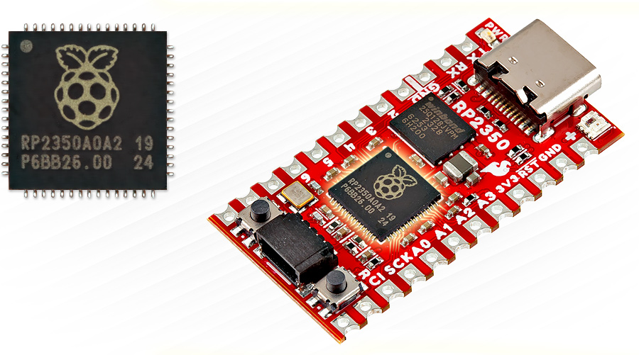

# [midi2_cpp](../..) | Device MIDI 2.0
## SparkFun Pro Micro RP2350

USB MIDI 2.0 **device** example for the **SparkFun Pro Micro RP2350**. Headless, single-file showcase of every MIDI 2.0 message category beyond MIDI 1.0, identical in behaviour to the [`rp2040-midi2`](../rp2040-midi2) example with the board target swapped to `sparkfun_promicro_rp2350` and the identity strings rebranded to `RP2350ProMicro`. Lives at `midi2_cpp/examples/sparkfun-promicro-rp2350-midi2/` and consumes the parent library directly (no vendoring).



> ⚠️ **TinyUSB override, not yet upstream.** The USB MIDI 2.0 device class driver this project depends on lives in TinyUSB [PR #3571](https://github.com/hathach/tinyusb/pull/3571), still under review. Until that PR merges into `hathach/tinyusb`, this build pulls a personal fork ([`sauloverissimo/tinyusb` branch `feat/midi2-device-host-driver`](https://github.com/sauloverissimo/tinyusb/tree/feat/midi2-device-host-driver)) at a pinned SHA. Treat the build as **beta**: when the PR lands upstream the override goes away and this README will point at the official TinyUSB.

## What this is

`sparkfun-promicro-rp2350-midi2` is the platform layer for a MIDI 2.0 device on the SparkFun Pro Micro RP2350. It owns:

- Pico SDK board init (`board_init`, `tusb_init`) on `PICO_BOARD=sparkfun_promicro_rp2350`
- TinyUSB MIDI 2.0 device class wiring (override of TinyUSB **PR #3571 fork**, *not yet merged upstream*, fetched on demand via CMake FetchContent)
- USB descriptors (VID `0xCAFE`, PID `0x4075`, product string `RP2350ProMicro`)
- The five [midi2_cpp](https://github.com/sauloverissimo/midi2_cpp) platform hooks already wired: `setWriteFn`, `feedRx`, `setNowFn`, `setMounted` / `setAltSetting`, `CI::setRngFn`

After `rp2040_midi2::init(midi, ci)`, the application sees only `m2device` and `m2ci`. It never touches `tud_*`, `pico_*`, or any USB symbol. Replicating the same shape on another board is a matter of writing `<board>_midi2.{h,cpp}` with the same two-function surface.

## What this is not

Not a finished product. The bundled `sparkfun-promicro-rp2350-midi2-showcase` executable is a **demo application** built on top of this core: it exercises every category of UMP message MIDI 2.0 brings beyond MIDI 1.0, then loops. Real applications copy this core and replace the showcase with their own behaviour layer.

## Identification

| Field | Value |
|---|---|
| USB VID | `0xCAFE` |
| USB PID | `0x4075` |
| USB Manufacturer | `github.com/sauloverissimo` |
| USB Product | `RP2350ProMicro` |
| MIDI-CI Manufacturer ID | `{0x7D, 0x00, 0x00}` (MIDI Association educational/non-commercial prefix) |
| MIDI-CI Family / Model / Version | `0x0001 / 0x0001 / 0x00010000` |
| UMP Endpoint Name | `RP2350ProMicro` |
| Product Instance ID | `RP2350ProMicro-showcase-0001` |

## Build

Requirements:

- **Pico SDK 2.x** with `PICO_SDK_PATH` exported. RP2350 support is in 2.0+.
- **arm-none-eabi-gcc** toolchain (Arm GNU embedded, 9+ recommended). The Pico SDK selects the Cortex-M33 variant automatically when `PICO_BOARD=sparkfun_promicro_rp2350`; no toolchain swap needed.
- **CMake 3.14+**
- Internet on the first `cmake -B build` (FetchContent pulls the TinyUSB fork)

```bash
git clone https://github.com/sauloverissimo/midi2_cpp.git
cd midi2_cpp/examples/sparkfun-promicro-rp2350-midi2
cmake -B build         # first run fetches the TinyUSB PR #3571 fork (~5 MB, internet required)
cmake --build build -j # offline from here on
```

Flash the resulting `build/sparkfun-promicro-rp2350-midi2-showcase.uf2` onto a SparkFun Pro Micro RP2350 in BOOTSEL mode (hold BOOT, plug USB-C, drop the UF2 onto the RP2350 mass storage that appears).

The TinyUSB fork lives in `build/_deps/tinyusb_fork-src` (gitignored). To point at a working copy of the fork already on disk:

```bash
cmake -B build -DPICO_TINYUSB_PATH=/path/to/your/tinyusb
```

## Hardware

| Pin | Use |
|---|---|
| USB-C | MIDI 2.0 device (the only USB function, no CDC stdio) |
| GP0  | UART TX (debug print @ 115200 8N1, labelled `TX` on the silkscreen) |
| GP1  | UART RX (labelled `RX`) |
| GP25 | On-board WS2812 RGB LED (not driven by this example) |
| GP16 | Qwiic SCL (not driven by this example) |
| GP17 | Qwiic SDA (not driven by this example) |
| BOOT | Hold while plugging USB-C to enter BOOTSEL mode |
| RST  | On-board reset button |

## Showcase

What the bundled `sparkfun-promicro-rp2350-midi2-showcase` executable demonstrates after enumeration. Constants in [`src/main.cpp`](src/main.cpp), adjust to taste. Each cycle is ~22 s and loops continuously while the device stays mounted.

**Always-on (boot to forever):**

- **JR Timestamp heartbeat** every 500 ms (MT 0x0 status 0x2), keeps Linux ALSA polling alive on idle endpoints
- **UMP Stream Discovery responder** (MT 0xF), replies to host-side Endpoint Discovery and Function Block Discovery with Endpoint Info, Device Identity, Endpoint Name, Product Instance ID, Stream Config Notify, FB Info, FB Name
- **MIDI-CI Discovery + PE Capability + PE Get** auto-replied via `m2ci`'s Appendix E convenience responder
- **1 Custom Profile** registered (id `7D 00 00 01 00`) with Enable/Disable callbacks
- **3 Properties** in PE: static `DeviceInfo`, dynamic `ChannelList`, subscribable `OverlayRate`
- **Process Inquiry** (`setMidiReport`) configured with system + channel + note bitmaps

**Per cycle (~22 s):**

| Scene | Content | Why MIDI 2.0 only |
|---|---|---|
| **A, Flex Data suite** | Tempo (120 BPM), Time Sig (4/4), Key Sig (C major), Metronome, Chord Name (Cmaj7), Start of Clip | MT 0xD + 0xF, no MIDI 1.0 equivalent |
| **B, Per-Note expression stack** | Sustained C4 with Per-Note Pitch Bend (5 Hz vibrato), Registered Per-Note Controller #7 (volume), Assignable Per-Note Controller #74 (brightness), Per-Note Management Reset | Per-Note family does not exist in MIDI 1.0 |
| **C, Resolution showcase** | Chromatic walk C5 to G#5 with **16-bit velocity** ramp + **32-bit CC #74** sweep + **32-bit Pitch Bend** ramp + **32-bit Poly Pressure** + **32-bit Channel Pressure** | MIDI 1.0 caps at 7-bit / 14-bit |
| **D, Program + Bank** | Program Change with bank MSB/LSB in a single UMP | MIDI 1.0 needs three messages |
| **E, RPN / NRPN / Relative** | RPN 0/0 (Pitch Bend Sensitivity), NRPN, Relative RPN (+delta), Relative NRPN (-delta) | RPN/NRPN as first-class + Relative are MIDI 2.0 only |
| **F, Note Attribute** | Note On with `attribute_type=0x03` (pitch_7_9), E4 +50 cents | Microtonal Note Attribute is MIDI 2.0 only |
| **G, SysEx8** | 16 raw 8-bit bytes with no 7-bit aliasing | MT 0x5 is MIDI 2.0 only |
| **H, Delta Clockstamp** | DCTPQ=480 + Delta Clockstamp=240 ticks | MT 0x0 utility messages are MIDI 2.0 only |
| **I, PE Notify** | Broadcast `OverlayRate` change to subscribers (value increments per cycle) | Property Exchange is MIDI 2.0 only |
| **J, End of Clip** | Sequencer End of Clip marker | MT 0xF status 0x21, MIDI 2.0 only |

Every scene logs to UART so a USB-Serial adapter on the `TX` pad (GP0) lets you watch the timeline live.

## Validation

Pair this device with one of the host examples to validate the round trip end to end at the wire level:

- [`adafruit-feather-rp2040-host-midi2`](../adafruit-feather-rp2040-host-midi2) shows decoded UMP on a 128x64 SSD1306 OLED.
- [`adafruit-feather-rp2040-bridge-midi2`](../adafruit-feather-rp2040-bridge-midi2) forwards to a PC running Microsoft MIDI Services Console.

Both consume the same TinyUSB PR #3571 fork plus the Pico-PIO-USB SHA pinned in their respective `CMakeLists.txt`. Plug a USB-C-male to USB-A-male cable from the Pro Micro RP2350 into the Feather's USB-A port and the showcase cycle becomes visible on the host side.

For a direct PC validation, plug the device straight into a laptop and inspect the enumeration with [Microsoft MIDI Services Console](https://github.com/microsoft/MIDI) on Windows, `amidi -l` on Linux, or Audio MIDI Setup on macOS. Expected report on the Microsoft MIDI Services Console:

- Native data format: Universal MIDI Packet
- Protocol: Midi2
- MIDI 2.0 Protocol: True
- Name: `RP2350ProMicro`
- USB VID / PID: `CAFE / 4075`

## What lives where

```
midi2_cpp/
├── src/                            parent library (consumed by this example
│                                   via ../../src in this CMakeLists)
└── examples/sparkfun-promicro-rp2350-midi2/
    ├── CMakeLists.txt              FetchContent for TinyUSB PR #3571 + targets
    ├── pico_sdk_import.cmake
    ├── README.md
    ├── board/
    │   ├── banner.png              repo banner (used in this README)
    │   ├── pinout_back.png         Pro Micro RP2350 back-side GPIO reference
    │   └── dimensions.png          PCB dimensions diagram, ~33 x 18 mm
    └── src/
        ├── rp2040_midi2.h          public API of the core (init + task), shared name with rp2040-midi2 (same RP-family USB IP)
        ├── rp2040_midi2.cpp        Pico SDK + TinyUSB glue, all hooks wired
        ├── usb_descriptors.c       USB MIDI 2.0 descriptors (VID 0xCAFE, PID 0x4075, product `RP2350ProMicro`)
        ├── tusb_config.h           TinyUSB config (1 group, 1 function block)
        └── main.cpp                showcase entry, full-spec MIDI 2.0 demo
```

The TinyUSB PR #3571 fork is fetched at configure time into `build/_deps/tinyusb_fork-src` (gitignored). This example folder itself is ~1 MB.

## License

MIT, inherits the parent [`midi2_cpp` LICENSE](../../LICENSE). The TinyUSB fork (fetched on demand) is MIT (upstream by hathach, fork by sauloverissimo carrying the MIDI 2.0 class drivers from the still-open [PR #3571](https://github.com/hathach/tinyusb/pull/3571)).
