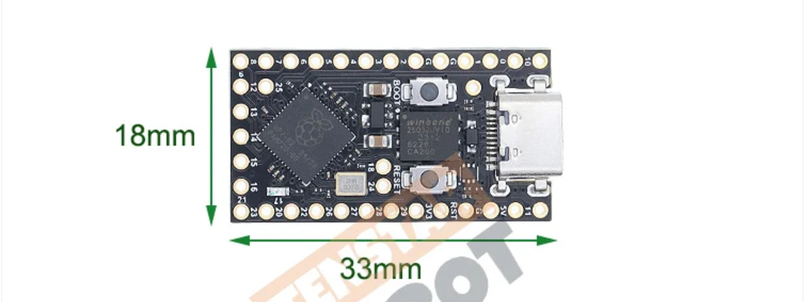

# [midi2_cpp](../..) | Device MIDI 2.0
## RP2040 Pro Micro (Tenstar Robot)

USB MIDI 2.0 **device** example for the **Tenstar Robot RP2040 Pro Micro**. Deterministic UMP catalog emitter, 101 entries covering every MT category in M2-104-UM v1.1.2. Lives at `midi2_cpp/examples/ump-test-bench-rp2040/` and consumes the parent library directly (no vendoring).



> ⚠️ **TinyUSB override, not yet upstream.** The USB MIDI 2.0 device class driver this project depends on lives in TinyUSB [PR #3571](https://github.com/hathach/tinyusb/pull/3571), still under review. Until that PR merges into `hathach/tinyusb`, this build pulls a personal fork ([`sauloverissimo/tinyusb` branch `feat/midi2-device-host-driver`](https://github.com/sauloverissimo/tinyusb/tree/feat/midi2-device-host-driver)) at a pinned SHA. Treat the build as **beta**: when the PR lands upstream the override goes away and this README will point at the official TinyUSB.

## What this is

`ump-test-bench-rp2040` is the platform layer for a deterministic UMP catalog emitter on the RP2040 Pro Micro. It owns:

- Pico SDK board init (`board_init`, `tusb_init`)
- TinyUSB MIDI 2.0 device class wiring (override of TinyUSB **PR #3571 fork**, *not yet merged upstream*, fetched on demand via CMake FetchContent)
- USB descriptors (VID `0xCAFE`, PID `0x4078`, product string `UMP Reference Emitter`)
- The five [midi2_cpp](https://github.com/sauloverissimo/midi2_cpp) platform hooks already wired: `setWriteFn`, `feedRx`, `setNowFn`, `setMounted` / `setAltSetting`, `CI::setRngFn`
- 101-entry UMP catalog covering every MT category in M2-104-UM v1.1.2 (Flex Data 0x00 / 0x01 / 0x02, MIDI 2.0 + MIDI 1.0 Channel Voice, System Common / Real-Time, SysEx7, SysEx8, UMP Stream, Utility)
- Three coexisting trigger modes: continuous cycle, inbound NoteOn `group=15` trigger, inbound CC 120 / 121 `group=15` loop start / stop

After `rp2040_midi2::init(midi, ci)`, the application sees only `m2device` and `m2ci`. It never touches `tud_*`, `pico_*`, or any USB symbol. Replicating the same shape on another board is a matter of writing `<board>_midi2.{h,cpp}` with the same two-function surface.

## What this is not

Not a finished product. The bundled `ump-test-bench-rp2040-showcase` executable is a **demo application** built on top of this core: it cycles a deterministic UMP catalog while accepting on-demand triggers from the host. Real applications copy this core and replace the catalog with their own emitter.

## Identification

| Field | Value |
|---|---|
| USB VID | `0xCAFE` |
| USB PID | `0x4078` |
| USB Manufacturer | `MIDI 2.0 Test Bench` |
| USB Product | `UMP Reference Emitter` |
| UMP Endpoint Name | `UMP Reference Emitter` |
| Product Instance ID | `UMPReferenceEmitter-bench-0001` |
| Function Block | 1 bidirectional, `firstGroup=0`, `numGroups=1`, name `Test Bench Group 0` |
| MIDI-CI Manufacturer ID | `{0x7D, 0x00, 0x00}` (MIDI Association educational/non-commercial prefix) |
| MIDI-CI Family / Model / Version | `0x0001 / 0x0001 / 0x00010000` |

## Build

Requirements:

- **Pico SDK 2.x** with `PICO_SDK_PATH` exported
- **arm-none-eabi-gcc** toolchain (Arm GNU embedded, 9+ recommended)
- **CMake 3.14+**
- Internet on the first `cmake -B build` (FetchContent pulls the TinyUSB fork)

```bash
git clone https://github.com/sauloverissimo/midi2_cpp.git
cd midi2_cpp/examples/ump-test-bench-rp2040
cmake -B build         # first run fetches the TinyUSB PR #3571 fork (~5 MB, internet required)
cmake --build build -j # offline from here on
```

Flash the resulting `build/ump-test-bench-rp2040-showcase.uf2` onto the RP2040 Pro Micro in BOOTSEL mode (drag-and-drop or `picotool load`).

The TinyUSB fork lives in `build/_deps/tinyusb_fork-src` (gitignored). To point at a working copy of the fork already on disk:

```bash
cmake -B build -DPICO_TINYUSB_PATH=/path/to/your/tinyusb
```

## Hardware

| Pin | Use |
|---|---|
| USB-C | MIDI 2.0 device (the only USB function, no CDC stdio) |
| GP0 | UART TX (EMIT log @ 115200 8N1) |
| GP1 | UART RX |
| BOOT button | Hold while plugging USB-C to enter BOOTSEL mode |
| RESET button | Reboot |

## Operating modes

| Mode | Trigger | Behavior |
|---|---|---|
| Continuous cycle | always on while mounted with `alt=1` | Catalog cycles entries 0..100..0..100... forever, one entry every 50 ms (full pass ~5 s) |
| NoteOn trigger | inbound MIDI 2.0 NoteOn, `group=15`, `channel=0` | Fires catalog index = `noteNumber` once, immediately, alongside the running cycle |
| CC loop start | inbound MIDI 2.0 CC #120, `group=15`, `channel=0` | Pauses the cycle; top byte of CC value = index to lock on; re-emits that entry every 50 ms |
| CC loop stop | inbound MIDI 2.0 CC #121, `group=15`, `channel=0` | Resumes the cycle from where it was |

Every emitted entry logs `EMIT idx=## label=... words=W0 W1 W2 W3` on UART so a USB-Serial adapter on GP0 lets you watch the timeline live.

## Spec coverage

**Tier A** (full UMP showcase). 101 of 101 entries implemented.

| UMP MT | Spec section | Indices | Source-of-truth API |
|---|---|---|---|
| 0x0 Utility | M2-104-UM §7.2 | 94..98 | `sendNoop`, `sendJRClock`, `sendJRTimestamp`, `sendDctpq`, `sendDeltaClockstamp` |
| 0x1 System Common / Real-Time | M2-104-UM §7.6 | 64..73 | `sendSystem*` |
| 0x2 MIDI 1.0 Channel Voice | M2-104-UM §7.3 | 59..63 | `sendMidi1Note*`, `sendMidi1Cc`, `sendMidi1PitchBend`, `sendMidi1Program` |
| 0x3 SysEx7 | M2-104-UM §7.7 | 74..77 | `sendSysEx7` (single + multi-packet) |
| 0x4 MIDI 2.0 Channel Voice | M2-104-UM §7.4 | 35..58 | `sendNoteOn/Off`, `sendCC`, `sendPitchBend`, `sendPolyPressure`, `sendChannelPressure`, `sendProgram`, `sendPerNotePitchBend`, `sendPerNoteManagement`, `sendRegPerNoteController`, `sendAsnPerNoteController`, `sendRpn`, `sendNrpn`, `sendRelRpn`, `sendRelNrpn` |
| 0x5 SysEx8 | M2-104-UM §7.7 | 78..81 | `sendSysEx8` (single + multi-packet) |
| 0xD Flex Data | M2-104-UM §7.5 | 0..34 | `sendTempo`, `sendTimeSignature`, `sendKeySignature`, `sendMetronome`, `sendChordName`, `sendFlexText` |
| 0xF UMP Stream | M2-104-UM §7.1 | 82..93 | `sendEndpointInfo`, `sendDeviceIdentity`, `sendEndpointName*`, `sendProductInstanceId*`, `sendStreamConfigNotify`, `sendFbInfo`, `sendFbName*`, `sendStartOfClip`, `sendEndOfClip` |

MIDI-CI surface: minimum (Endpoint Discovery + Device Identity). Profile, PE and PI subsystems are not exercised.

## Validation

1. **Linux**: `lsusb` shows `0xCAFE:0x4078`, then `amidi -l` lists `UMP Reference Emitter`. Any UMP-aware logger captures the auto-emit on plug.
2. **Windows**: `midi enumerate midi-services-endpoints -i` lists `UMP Reference Emitter`. `midi endpoint <id> monitor -c capture.txt -n` captures every UMP from auto-emit.
3. **Cross-check** the EMIT log on UART against the captured `.txt` file. The bytes should be identical.

## What lives where

```
midi2_cpp/
├── src/                            parent library (consumed by this example
│                                   via ../../src in this CMakeLists)
└── examples/ump-test-bench-rp2040/
    ├── CMakeLists.txt              FetchContent for TinyUSB PR #3571 + targets
    ├── pico_sdk_import.cmake
    ├── README.md
    ├── board/
    │   ├── banner.png              repo banner (used in this README)
    │   └── rp2040pinout.png        Pro Micro GPIO reference
    └── src/
        ├── rp2040_midi2.h          public API of the core (init + task + pumpRaw)
        ├── rp2040_midi2.cpp        Pico SDK + TinyUSB glue, all hooks wired
        ├── usb_descriptors.c       USB MIDI 2.0 descriptors
        ├── tusb_config.h           TinyUSB config (1 group, 1 function block)
        ├── catalog.h               catalog API (101 entries)
        ├── catalog.cpp             catalog implementation
        └── main.cpp                showcase entry, trigger handlers + auto-emit driver
```

The TinyUSB PR #3571 fork is fetched at configure time into `build/_deps/tinyusb_fork-src` (gitignored). This example folder itself is ~1 MB.

## License

MIT, inherits the parent [`midi2_cpp` LICENSE](../../LICENSE). The TinyUSB fork (fetched on demand) is MIT (upstream by hathach, fork by sauloverissimo carrying the MIDI 2.0 class drivers from the still-open [PR #3571](https://github.com/hathach/tinyusb/pull/3571)).
