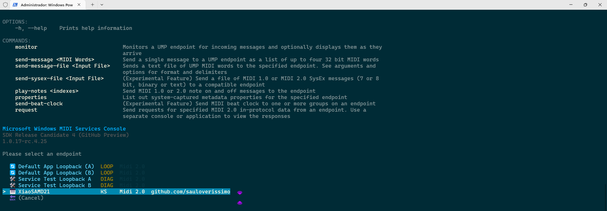

# [midi2_cpp](../..) | Device MIDI 2.0
## Seeed Studio XIAO SAMD21

Tier C minimal-core USB MIDI 2.0 device example for the [**Seeed Studio XIAO SAMD21**](https://wiki.seeedstudio.com/Seeeduino-XIAO/) (ATSAMD21G18A, 48 MHz Cortex-M0+, 32 KB SRAM, 256 KB flash). Native CMake build via TinyUSB's `family_support.cmake`, ARM GNU toolchain, no Arduino IDE involvement. Lives at `midi2_cpp/examples/xiao-samd21-midi2/` and consumes the parent `midi2_cpp` library directly via `../../src`.



> ⚠️ **TinyUSB override, not yet upstream.** The USB MIDI 2.0 device class driver this recipe depends on lives in TinyUSB [PR #3571](https://github.com/hathach/tinyusb/pull/3571), still under review. Until that PR merges into `hathach/tinyusb`, the build pulls a personal fork ([`sauloverissimo/tinyusb` branch `feat/midi2-device-host-driver`](https://github.com/sauloverissimo/tinyusb/tree/feat/midi2-device-host-driver)) at a pinned SHA via CMake FetchContent. Treat as **beta**; when the PR lands the override goes away.

PID `0x40F0` distinguishes this device (Tier 3 / experimental window per the project's pid-allocation table).

## What this is

`xiao-samd21-midi2` is a **first-of-tier** recipe in the project portfolio: it is the first to build TinyUSB MIDI 2.0 device class on a non-RP2040 chip via the **TinyUSB native CMake build system** (`hw/bsp/family_support.cmake`), instead of going through Pico SDK, ESP-IDF, or Arduino IDE wrappers. The pattern transfers cleanly to any board with a TinyUSB BSP (SAMD21, SAMD51, nRF52840, STM32, etc.) by changing one line: `set(BOARD <bsp-name>)`.

The recipe owns:
- TinyUSB BSP `seeeduino_xiao` (already upstream in TinyUSB fork)
- Microchip SAMD21 SDK + ARM CMSIS_5 (auto-fetched via `tools/get_deps.py samd2x_l2x` at first configure)
- USB descriptors (VID `0xCAFE`, PID `0x40F0`, Product "XiaoSAMD21")
- midi2_cpp C++17 wrapper compiled against the SAMD21 (Cortex-M0+ thumb) target
- The five midi2_cpp platform hooks: `setWriteFn`, `feedRx`, `setNowFn`, `setMounted` / `setAltSetting`, `CI::setRngFn`
- On-board yellow LED on PA17 (lit while USB mounted)

After `xiao_samd21_midi2::init(midi, ci)`, the application sees only `m2device` and `m2ci`. It never touches `tud_*`, `board_*`, or any TinyUSB symbol directly.

## What this is not

Not a finished product. The bundled `xiao-samd21-midi2` executable is a smoke-test demo (chromatic walk + Discovery responder + JR heartbeat). Real applications copy this core and add their own behaviour:

- `xiao-samd21-controller` could add capacitive touch on the QTouch pins (A0, A6, A7, A8, A10) emitting Per-Note Pitch Bend
- `xiao-samd21-sensor-bridge` could expose I2C sensors (D4 SDA / D5 SCL) as MIDI 2.0 controllers

## Identification

| Field | Value |
|---|---|
| USB VID | `0xCAFE` (TinyUSB educational, development-only) |
| USB PID | `0x40F0` |
| USB Manufacturer | `github.com/sauloverissimo` |
| USB Product | `XiaoSAMD21` |
| USB Serial (fallback) | `XiaoSAMD21-0001` |
| Endpoint Name | `XiaoSAMD21` |
| Product Instance ID | `XiaoSAMD21-showcase-0001` |
| Function Block Name | `Main` |
| MIDI-CI Manufacturer ID | `{0x7D, 0x00, 0x00}` (MIDI Association educational/non-commercial prefix) |
| MIDI-CI Family / Model / Version | `0x0001 / 0x0001 / 0x00010000` |

> **VID `0xCAFE` is development-only.** Production firmware MUST replace both `idVendor` and `idProduct` with a real allocation (`0x1209` pid.codes, `0x16C0` V-USB, or a purchased USB-IF VID).

## Build

Requirements:

- **CMake 3.20+**
- **arm-none-eabi-gcc** (Arm GNU embedded toolchain, 9+ recommended; tested with 13.2.1)
- **Python 3** (for TinyUSB's `tools/get_deps.py` to fetch the Microchip SAMD21 SDK + CMSIS_5 at first configure)
- Internet on the first `cmake -B build` (FetchContent of the TinyUSB fork + first run of get_deps.py)

```bash
git clone https://github.com/sauloverissimo/midi2_cpp.git
cd midi2_cpp/examples/xiao-samd21-midi2
cmake -B build         # ~2 min on first run: fetches TinyUSB fork + SAMD21 deps
cmake --build build -j # ~30 s; offline from here on
```

Output: `build/xiao-samd21-midi2.elf` + `build/xiao-samd21-midi2.bin` + `build/xiao-samd21-midi2.hex`. UF2 conversion is a separate step (TinyUSB's `family_support.cmake` does not run uf2conv automatically):

```bash
python3 build/_deps/tinyusb_fork-src/tools/uf2/utils/uf2conv.py \
    -c -b 0x2000 -f SAMD21 \
    -o build/xiao-samd21-midi2.uf2 build/xiao-samd21-midi2.bin
```

The `0x2000` offset matches the XIAO's UF2 bootloader region; firmware lives above it. `SAMD21` is the family identifier accepted by `uf2conv.py`.

To point at a working copy of the TinyUSB fork already on disk:

```bash
cmake -B build -DTINYUSB_FORK_PATH=/path/to/your/tinyusb
```

## Flash

The XIAO SAMD21 ships with a UF2-compatible bootloader. Two flash paths:

### Drag-and-drop (UF2)

1. Enter bootloader on the XIAO. The board has no Reset button, only two **RST pads** at the USB-C end of the board. Two ways:
   - **Wire short**: bridge the two RST pads with a wire / tweezers / paperclip TWICE in quick succession (interval < 500 ms). Board re-enumerates as `Arduino` UF2 mass-storage with VID:PID `2886:002f`.
   - **1200 bps touch (preferred when the firmware enumerates a serial port)**: `stty -F /dev/ttyACM<N> 1200; sleep 1`. The Adafruit-style UF2 bootloader on the XIAO reacts to a 1200 bps open by jumping to bootloader. This works without touching the hardware.
2. Mount the BOOTSEL drive (most desktop file managers auto-mount; otherwise `udisksctl mount -b /dev/sd<x>1`).
3. Copy `build/xiao-samd21-midi2.uf2` to the mounted drive. Board auto-reboots into the firmware. After ~3 s, `lsusb | grep cafe:40F0` should show `XiaoSAMD21`.

### bossac (binary upload, alternative)

```bash
# Enter bootloader first (RST pad short or 1200 bps touch as above)
sudo bossac -i -d --port=/dev/ttyACM<N> -U -i --offset=0x2000 -w -v build/xiao-samd21-midi2.bin -R
```

## Hardware

| Pin | Use |
|---|---|
| USB-C | USB FS device interface (MIDI 2.0) |
| PA17 (D13 silkscreen, internal yellow LED) | `LED_PIN` per BSP. Lit while USB is mounted |
| RST pads (top of board, two small gold pads) | Bridge twice in quick succession to enter UF2 bootloader |

The XIAO has no built-in Reset BUTTON; the RST signal lives on two solder pads at the USB-C end. Bridge them with a wire / tweezers within ~500 ms to enter bootloader, OR use the 1200 bps touch trick on the serial port (see the **Flash** section above).

The MCU silicon datasheet ([ATSAMD21G18A](https://files.seeedstudio.com/wiki/Seeeduino-XIAO/res/ATSAMD21G18A-MU-Datasheet.pdf)) is shared across every SAMD21 recipe and is hosted on Seeed's CDN.

## Spec coverage

**Tier C** (minimal core). Hardware-bracket reference for SAMD21 with 32 KB SRAM.

### What this recipe emits and demonstrates

| UMP MT | Transport | Spec section | Showcase Scene | Notes |
|---|---|---|---|---|
| 0x0 Utility | USB | M2-104-UM §3 | JR heartbeat | 500 ms periodicity |
| 0x4 MIDI 2.0 Channel Voice | USB | M2-104-UM §7 | chromatic walk | NoteOn/Off + 32-bit CC #74 sweep |
| 0xF UMP Stream | USB | M2-104-UM §10 | (responder, not a Scene) | Endpoint Discovery, Device Identity, Endpoint Name, Product Instance ID, Stream Config Notify, FB Info, FB Name |

### MIDI-CI surface (M2-101-UM)

| Subsystem | Coverage |
|---|---|
| Discovery (Initiator + Responder) | responder: yes (MUID, Manufacturer, Family, Model, Version) |
| Profile Configuration | not advertised (Tier C drop) |
| Property Exchange | not advertised (Tier C drop) |
| Process Inquiry | not advertised (Tier C drop) |

### What this recipe does NOT cover (and why)

- **Per-Note expression family (MT 0x4 sub-statuses)**: the SAMD21 has the cycles, but Tier C keeps emissions minimal to leave SRAM headroom for the user's own application code on top.
- **MT 0x3 SysEx7 / MT 0x5 SysEx8**: parent library reassembly buffers (default 512 bytes each) plus midi2_cpp + TinyUSB push past 32 KB SRAM under load. SysEx out of scope.
- **MT 0xD Flex Data**: scope drop. A future Tier C+ variant could opt into Tempo + Time Sig only.
- **Property Exchange storage**: requires 8 properties + subscriber list; SAMD21 SRAM cannot afford it without dropping other functionality.
- **Process Inquiry capability advertising**: drops with PE.
- **MIDI 2.0 Initiator role for CI**: this is a device-side responder; an Initiator demo lives in the project's host recipes.

For full Tier A coverage on a SAMD21-class chip, see the future `xiao-samd51-midi2` recipe (Phase 2; SAMD51 has 4x the SRAM of SAMD21 and supports the full Showcase).

## Showcase

What the bundled `xiao-samd21-midi2` executable demonstrates after enumeration, while `usb_midi2.altSetting() == 1`:

**Always-on:**

- **JR Timestamp heartbeat** every 500 ms (MT 0x0 status 0x2)
- **UMP Stream Discovery responder** (full Endpoint + FB Discovery surface)
- **MIDI-CI Discovery responder** (MUID, Manufacturer, Family, Model, Version)
- **On-board yellow LED on PA17** lit while mounted

**Per cycle (~4.5 s):**

| Window | Detail |
|---|---|
| 0 to 4.0 s | Chromatic walk C4 → G#4 (8 steps, 500 ms each), 16-bit velocity ramp `0x2000` → `0xFFFF`, 32-bit CC #74 sweep `0x20000000` → `0xFFFFFFFF` |
| 4.0 to 4.5 s | Final NoteOff |
| 4.5 s to 6.5 s | Gap before next cycle |

## Validation

Hardware steps (Linux):

1. Flash via UF2 drag-and-drop or `bossac` per the **Flash** section above.
2. Confirm enumeration:
   ```bash
   lsusb | grep cafe:40F0
   # expected: Bus 001 Device NN: ID cafe:40f0 github.com/sauloverissimo XiaoSAMD21
   amidi -l
   # expected: IO  hw:N,1,0  Group 1 (Main)
   ```
3. Capture UMPs:
   ```bash
   PORT=$(aseqdump -l | grep -i XiaoSAMD21 | awk '{print $1}' | tr -d ':')
   timeout 8 aseqdump -p ${PORT}
   # expected: NoteOn / NoteOff C4..G#4 sequence with rising velocity
   ```
4. Pair with a known-good MIDI 2.0 host recipe ([`adafruit-feather-rp2040-host-midi2`](../adafruit-feather-rp2040-host-midi2/)) for cross-validation: plug the XIAO into the Feather's USB-A, the Feather's OLED should display `[0] MIDI 2.0` with the chromatic walk events scrolling.

## What lives where

```
midi2_cpp/examples/xiao-samd21-midi2/
├── README.md                          this file
├── CMakeLists.txt                     FetchContent TinyUSB fork + family_support
├── board/
│   ├── banner.png                     repo banner
│   ├── banner2.jpg                    alt banner (XIAO pinout 1)
│   ├── pinout.jpg                     Seeed pinout 1
│   ├── pinout-detailed.png            Seeed pinout 2 (function table)
│   └── XIAO-SAMD21-Schematic.pdf      Seeed v1.0 schematic
├── monitor/                           bench / Microsoft MIDI Console captures (TBD)
└── src/
    ├── main.cpp                       showcase entry, Tier C demo
    ├── xiao_samd21_midi2.{h,cpp}      board glue: board_init + tusb_init + hooks
    ├── usb_descriptors.c              VID/PID + descriptors
    └── tusb_config.h                  CFG_TUD_MIDI2 + endpoint sizes
```

The TinyUSB PR #3571 fork is fetched into `build/_deps/tinyusb_fork-src` (gitignored) on first configure. The Microchip SAMD21 SDK and ARM CMSIS_5 are fetched into the same tree under `hw/mcu/microchip/samd21/` and `lib/CMSIS_5/` by `tools/get_deps.py samd2x_l2x` (also auto-triggered at configure time).

## License

MIT, inherits the parent [`midi2_cpp` LICENSE](../../LICENSE). The TinyUSB fork (fetched on demand) is MIT (upstream by hathach, fork by sauloverissimo carrying the MIDI 2.0 class drivers from the still-open [PR #3571](https://github.com/hathach/tinyusb/pull/3571)). The Microchip SAMD21 SDK is BSD-3-Clause (Microchip Technology Inc.). Board pinout images are © Seeed Technology Co., Ltd. (educational use under fair-use scope of this open-source recipe).
